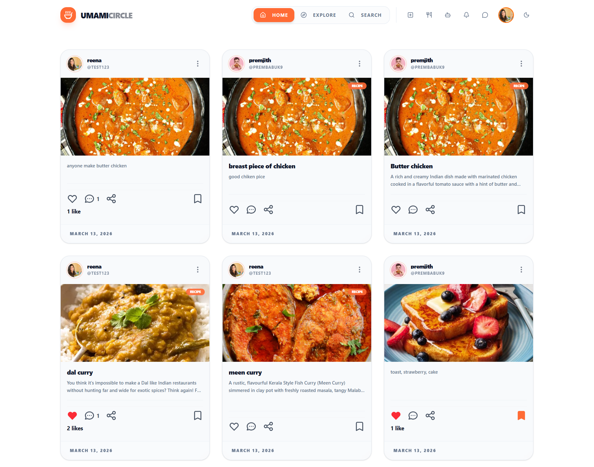
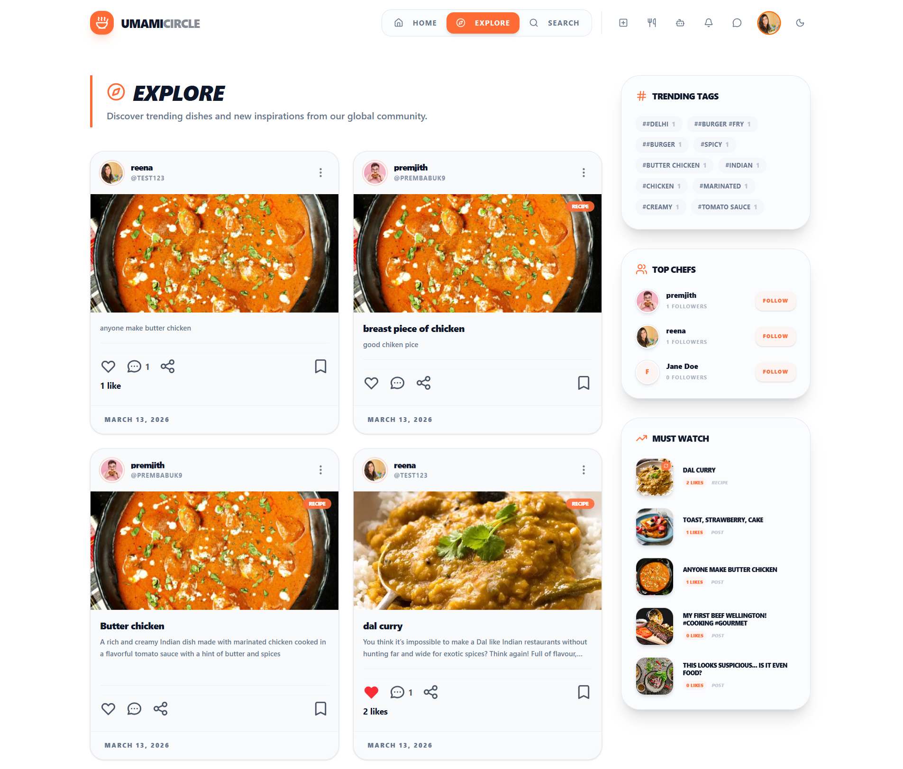
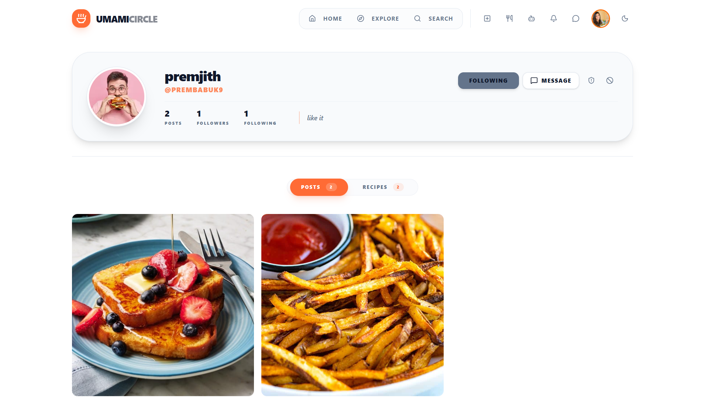
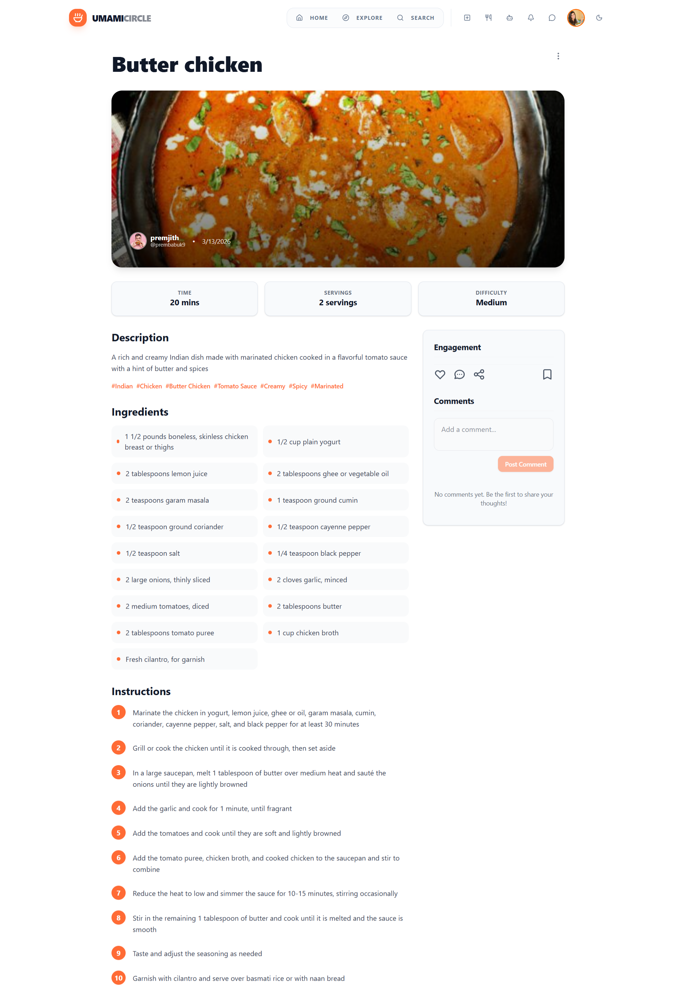
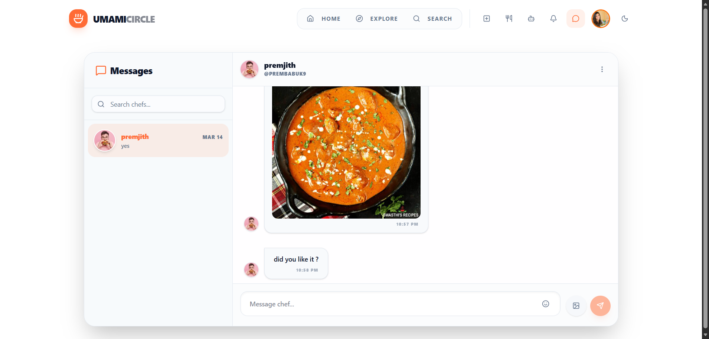
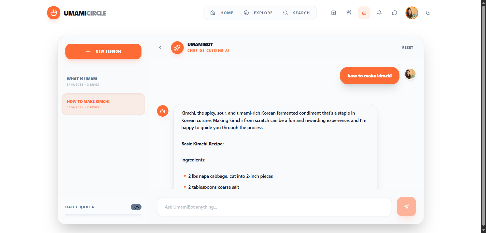
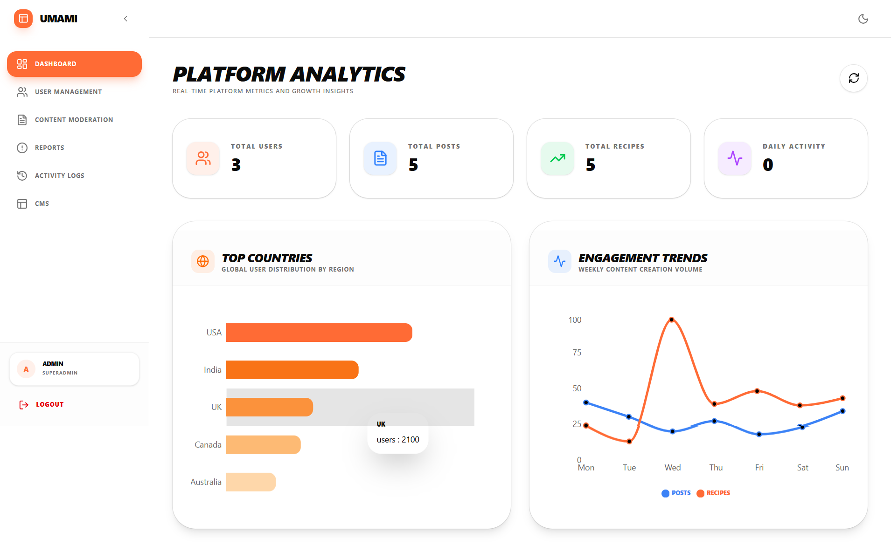

# 🍜 UmamiCircle

> A premium food-focused social media platform for culinary enthusiasts to share creations, discover recipes, and engage with a global community.

[](https://nodejs.org/)
[](https://reactjs.org/)
[](https://www.mongodb.com/)
[](https://expressjs.com/)
[](https://firebase.google.com/)

---

## 📖 About the Project

UmamiCircle is designed for food lovers, from professional chefs to home cooks. It provides a sophisticated environment to showcase high-quality food photography and detailed recipes, supported by an advanced AI infrastructure for moderation and creative assistance.

### Key Features
*   **Smart Feed**: High-resolution food posts and recipes with AI-powered moderation.
*   **UmamiBot**: An AI cooking assistant (powered by Llama 3.3) for recipe generation and culinary questions.
*   **Real-time Interaction**: Instant messaging and live notifications.
*   **Social Ecosystem**: Follow chefs, like creations, comment on dishes, and bookmark recipes.
*   **Professional Admin Panel**: Comprehensive moderation tools for user management and content safety.
*   **Premium Design**: Fully responsive, dark-mode-first UI optimized for mobile and desktop.

---

## 🛠 Tech Stack

### Frontend
- **Framework**: React (Vite)
- **Styling**: Tailwind CSS & shadcn/ui
- **State Management**: React Context API
- **Icons**: Lucide React

### Backend
- **Runtime**: Node.js & Express.js
- **Database**: MongoDB (Mongoose)
- **Real-time**: Socket.io
- **Security**: Helmet, Rate Limiting, & JWT

### Services & AI
- **Auth**: Firebase Authentication
- **Storage**: Cloudinary (Image management & transformations)
- **AI Engine**: Groq (Llama-3.3-70b-versatile)
- **Food Detection**: Hugging Face (Vision Transformer)
- **Moderation**: Sightengine (Safety) & Obscenity (Text filtering)

---

## 🚀 Getting Started

### Prerequisites
- **Node.js**: v18.x or higher
- **MongoDB**: Local instance or Atlas URI
- **Firebase Project**: For client-side auth and admin service account

### Installation

1. **Clone the repository**
   ```bash
   git clone https://github.com/your-username/UmamiCircle.git
   cd UmamiCircle
   ```

2. **Install Dependencies**
   ```bash
   # Root / Backend
   npm install

   # Frontend
   cd umami-frontend && npm install

   # Admin Panel
   cd ../umami-admin && npm install
   ```

3. **Environment Configuration**
   Each folder contains a `.env.example` file. Create a `.env` file in each directory based on these templates:
   - `./.env` (Backend)
   - `./umami-frontend/.env` (Frontend)
   - `./umami-admin/.env` (Admin)

### Running the Application

**Run Backend (Root):**
```bash
npm start
# Server runs on http://localhost:8080
```

**Run User Frontend:**
```bash
cd umami-frontend
npm run dev
# App runs on http://localhost:5173
```

**Run Admin Panel:**
```bash
cd umami-admin
npm run dev
# Admin runs on http://localhost:5174
```

---

## 📁 Project Structure

```text
UmamiCircle/
├── src/                # Backend source code
│   ├── config/         # DB and Service configurations
│   ├── middleware/     # Auth and Moderation logic
│   ├── models/         # Mongoose schemas
│   ├── routes/         # API endpoints
│   └── services/       # AI and Messaging services
├── umami-frontend/     # React user application
│   ├── src/components/ # UI and Layout components
│   └── src/pages/      # Feature-specific pages
├── umami-admin/        # React admin dashboard
│   ├── src/components/ # shadcn/ui components
│   └── src/pages/      # Moderation and analytics pages
├── tests/              # Comprehensive test suites
└── server.js           # Entry point
```

---

## 📸 Screenshots

## 📸 Screenshots

### Home Feed


### Explore Page


### Profile Page


### Recipe Detail


### Messages


### UmamiBot - AI Cooking Assistant


### Admin Dashboard


## 🤝 Contributing

1.  Fork the Project.
2.  Create your Feature Branch (`git checkout -b feature/AmazingFeature`).
3.  Commit your Changes (`git commit -m 'Add some AmazingFeature'`).
4.  Push to the Branch (`git checkout -b feature/AmazingFeature`).
5.  Open a Pull Request.
